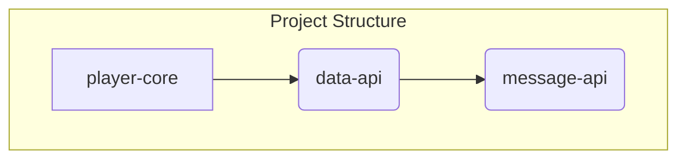

# Eternum Core Technical Overview

This document provides a technical overview of the Eternum Core project, a multi-module Java project for Minecraft
plugin development.

## High-Level Architecture

The project follows a modular architecture that separates concerns into distinct API and implementation modules. This
design promotes loose coupling, reusability, and platform independence for the core data logic.

* **API-First Design:** The project is split into `api` and `core` modules. The `api` modules define interfaces and data
  structures, while the `core` module provides the concrete implementation for the Minecraft server environment.
* **Dependency Flow:** The dependencies flow from the implementation to the APIs: `player-core` -> `data-api` ->
  `message-api`. This ensures that the API modules remain independent of any specific Minecraft platform.
* **Platform-Agnostic APIs:** The `message-api` and `data-api` modules are platform-agnostic, containing no references
  to Minecraft-specific libraries like Spigot or Paper.
* **Extensible Backend System:** The `data-api` uses an extensible backend system, allowing for different database
  technologies (SQL, MongoDB, JSON) to be used for data storage.

## Module Map

The project consists of the following Gradle modules:

| Module            | Purpose                                                                          | Key Packages & Classes                                                             | Dependencies  |
|:------------------|:---------------------------------------------------------------------------------|:-----------------------------------------------------------------------------------|:--------------|
| **`message-api`** | A platform-agnostic library for creating and sending styled messages to players. | `sh.harold.fulcrum.message`                                                        | None          |
| **`data-api`**    | A platform-agnostic API for managing persistent player data.                     | `sh.harold.fulcrum.api`, `sh.harold.fulcrum.backend`, `sh.harold.fulcrum.registry` | `message-api` |
| **`player-core`** | The main Minecraft (Paper) plugin that implements the APIs.                      | `sh.harold.fulcrum.playerdata`, `sh.harold.fulcrum.core`                           | `data-api`    |

---

### 1. `message-api`

This module provides a fluent API for building complex, translatable, and styleable messages.

* **Purpose:** To abstract away the complexities of Minecraft's chat component system and provide a simple, unified way
  to send messages.
* **Key Features:**
    * **Builder Pattern:** `MessageBuilder` provides a fluent interface for constructing messages with text, colors, and
      styles.
    * **Localization:** `TranslationUtil` supports internationalization (i18n) through key-based translation lookups.
    * **Styling:** `MessageStyle` and `ColorUtil` allow for applying colors and text decorations.
* **File Layout:**
    * `src/main/java/sh/harold/fulcrum/message/`: Core message classes.
    * `src/main/java/sh/harold/fulcrum/message/util/`: Utility classes for color and translation.

---

### 2. `data-api`

This is the heart of the data management system. It defines a complete abstraction layer for player data persistence.

* **Purpose:** To provide a consistent and extensible way to store and retrieve player data, regardless of the
  underlying storage technology or server platform.
* **Key Architectural Decisions:**
    * **Data-Access-Object (DAO) Pattern:** The `PlayerProfile` class acts as a DAO, representing a player's data and
      providing methods to access and modify it.
    * **Schema Definition via Annotations:** The API uses annotations like `@Table`, `@Column`, and `@ForeignKey` to
      define the database schema from plain Java objects (POJOs). The `AutoTableSchema` class processes these
      annotations to create the necessary database tables.
    * **Storage Backend Abstraction:** The `PlayerDataBackend` interface defines a contract for storage implementations.
      The project provides several backends out-of-the-box:
        * `JsonFileBackend`: Stores data in local JSON files.
        * `SqlDataBackend`: Stores data in a SQL database, with `SqliteDialect` and `PostgresDialect` for different
          database systems.
        * `MongoDataBackend`: Stores data in a MongoDB collection.
    * **Registry and Manager Classes:**
        * `PlayerDataRegistry`: Manages the registration of data schemas.
        * `PlayerProfileManager`: Manages the lifecycle of `PlayerProfile` objects.
        * `PlayerStorageManager`: Manages the underlying storage backends.
* **File Layout:**
    * `src/main/java/sh/harold/fulcrum/api/`: Annotations and interfaces for defining data schemas.
    * `src/main/java/sh/harold/fulcrum/backend/`: Implementations of the different storage backends.
    * `src/main/java/sh/harold/fulcrum/registry/`: Classes for managing data schemas and player profiles.

---

### 3. `player-core`

This module is the concrete implementation of the APIs for the Paper Minecraft server platform.

* **Purpose:** To integrate the `data-api` with a running Minecraft server, handle player lifecycle events, and provide
  commands for administration.
* **Entry Point:** The `sh.harold.fulcrum.PlayerDataPlugin` class is the main plugin entry point, extending
  `JavaPlugin`.
* **Wiring and Initialization:**
    1. On plugin startup, `PlayerDataPlugin` reads the `database-config.yml` file to determine which storage backend to
       use.
    2. It instantiates the appropriate `PlayerDataBackend` (e.g., `SqlDataBackend`).
    3. The `StorageManager` is initialized with the chosen backend.
    4. The `PlayerDataLifecycleListener` is registered to listen for player join and quit events, which triggers the
       loading and saving of `PlayerProfile` objects.
* **Platform-Specific Logic:** This module contains all the Paper-specific code, such as event listeners, command
  executors, and references to the Bukkit/Paper API.
* **File Layout:**
    * `src/main/java/sh/harold/fulcrum/playerdata/`: The main plugin class and event listeners.
    * `src/main/java/sh/harold/fulcrum/core/`: Core plugin logic, including the `StorageManager`.
    * `src/main/resources/`: Plugin configuration files (`plugin.yml`, `database-config.yml`).
