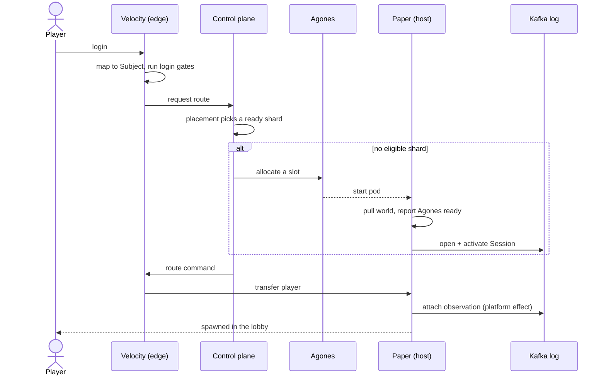

<div align="center">

# Fulcrum

**A governed runtime substrate for large Minecraft networks.**

[](https://github.com/haroldDOTsh/fulcrum/actions/workflows/publish.yml)
&nbsp;
&nbsp;
&nbsp;


&nbsp;
&nbsp;
&nbsp;

[Architecture](#architecture)   [Stack](#the-stack)   [Repo map](#repository-map)   [Build](#build-and-test)   [Operate](#run-and-operate)   [Extend](#build-on-fulcrum)   [Boundaries](#boundaries-and-non-goals)

</div>

---

Fulcrum is the substrate a Minecraft network runs on. The conventional pattern treats each Paper server as the source of truth for its slice of the world and stitches cross server features on afterward with a message bus and some optimism. Fulcrum starts from the other end: durable authorities own canonical state, a control plane places sessions and routes players, and a Paper or Velocity process becomes a host for runtime that was already governed before the player arrived.

The whole system turns on a single rule.

> [!IMPORTANT]
> **Authors declare experience intent.**
>
> Fulcrum owns execution, placement, routing, capacity, data authority, artifact resolution, and traceability.

Everything below is a consequence of taking that split seriously. This is the v2 architecture, published at `5.0.0-beta.1`.[^status]

---

## Architecture

Fulcrum is organized as responsibility planes. A plane is an ownership boundary, not a binary: a single-machine deployment co-locates most of them in one JVM, and a large production deployment pulls them apart into separate services. The contracts between planes stay the same either way.


```mermaid
flowchart LR
    Player(["Player"])

    subgraph EDGE["Edge plane"]
        V["Velocity proxy<br/>login gate   routing"]
    end
    subgraph CTRL["Control plane"]
        P["Placement   RouteAttempt<br/>Queue   Lifecycle   Faults"]
        AB["Allocation bridge"]
    end
    subgraph HOST["Host plane"]
        PA["Paper instance<br/>one Session   reducer   effects"]
    end
    subgraph DATA["Data authority plane"]
        AU["Subject   Presence   Route<br/>Session   Artifact authorities"]
    end
    subgraph STORE["Log + storage"]
        K[("Kafka log<br/>the spine")]
        ST[("Postgres   Cassandra<br/>Valkey   Object store")]
    end

    AG["Agones / Kubernetes<br/>fleets   warm pods   health"]
    CAP["Capabilities<br/>extension-point contributions"]

    Player --> V
    V -->|presence + route request| P
    P --> AB
    AB -->|request slot| AG
    AG -->|pod| PA
    P -->|route command| V
    V -->|transfer| PA
    V -->|typed commands| K
    PA -->|typed commands| K
    K --> AU
    AU --> ST
    AU -->|events + state| K
    CAP -.contributes.-> V
    CAP -.contributes.-> PA

    style EDGE fill:#dbeafe,stroke:#2563eb,color:#0b1220
    style CTRL fill:#fef3c7,stroke:#d97706,color:#0b1220
    style HOST fill:#dcfce7,stroke:#16a34a,color:#0b1220
    style DATA fill:#ede9fe,stroke:#7c3aed,color:#0b1220
    style STORE fill:#fee2e2,stroke:#dc2626,color:#0b1220
```

The planes and what each one owns:

| Plane             | Owns                                                                                    | Does not own                                          | Lives in                                                                   |
|-------------------|-----------------------------------------------------------------------------------------|-------------------------------------------------------|----------------------------------------------------------------------------|
| **Edge**          | Login admission, initial routing, player transfer, proxy commands.                      | Durable authority state.                              | `host:velocity-agent`                                                      |
| **Host**          | Paper events, world process, join/quit/chat bridge, host-local effects.                 | Canonical subject, route, presence, or session truth. | `host:paper-agent`, `host:tick-runtime-api`                                |
| **Control**       | Placement, allocation, lifecycle, route attempts, queue, faults, capability enablement. | Storage internals and Minecraft host APIs.            | `control:*`                                                                |
| **Authority**     | Aggregate mutation, command decisions, projections, events.                             | Placement policy and host effects.                    | `data:*`, external backends via `sdk:authority-sdk`                        |
| **Capability**    | Feature declarations and extension-point behavior.                                      | Kernel concepts or arbitrary plugin loading.          | `capability:*`, `sdk:authoring-sdk`                                        |
| **Content**       | Artifact metadata, object payloads, manifest resolution.                                | Runtime allocation.                                   | `core:artifact-layout`, `core:content-resolver`, `adapters:object-storage` |
| **Storage / log** | Kafka log, Postgres records, Cassandra projections, Valkey cache, object store.         | Domain policy.                                        | `data:store-*`                                                             |

### The kernel stays small

The kernel knows only the nouns it needs to route, place, execute, and observe work. Twelve of them, no more:

| Noun               | What it is                                                                         |
|--------------------|------------------------------------------------------------------------------------|
| `Subject`          | Durable identity of an actor. A player, a service, a bot. Not a live connection.   |
| `Presence`         | Live connection and location for a subject. High-churn, lease-fenced.              |
| `Experience`       | A player-facing surface or mode: lobby, realm, auction UI.                         |
| `Session`          | One live occurrence of an experience on one host.                                  |
| `Pool`             | A capacity class and placement target, realized as an Agones `Fleet`.              |
| `Slot`             | A claim on capacity from a pool.                                                   |
| `Instance`         | One running host process, usually one JVM in one pod.                              |
| `Route`            | Directed movement of a subject to a host or session.                               |
| `Effect`           | An output requested by a reducer or capability, classified host-local or platform. |
| `Capability`       | A governed feature package.                                                        |
| `Artifact`         | Immutable code, content, or world object, keyed by digest.                         |
| `ResolvedManifest` | The exact code, content, and contract set pinned for one session.                  |

Rank, punishment, party, guild, economy, cosmetics, profiles, realm ownership: none of these are kernel concepts. They live above the kernel as capabilities, because a rich `Player` object becomes a global junk drawer the moment two features both want a field on it.

> [!NOTE]
> `Subject`  is not a player object and it is not a connection. A subject is durable identity; a `Presence` is the live, leased, fenced fact that the subject is currently connected somewhere.

### The log is the spine

Canonical mutation does not happen in a database transaction inside a game server. It happens on a partitioned log. A host or capability emits a typed command; the owning authority validates it, applies it, and emits events; stores are updated as projections of that decision.

```text
host / capability emits typed command
  → Kafka command topic
  → authority partition owner
  → validate: principal + fencing + idempotency + deadline + revision CAS
  → projected stores (Postgres records, Cassandra views, Valkey cache)
  → Kafka events / state / response
```

This shape is what makes the network recoverable. If a projection is wrong, the authority record and the log are the recovery source, so the projection can be rebuilt rather than mourned.

> [!WARNING]
> Three invariants hold this together, one writer per aggregate partition; idempotency on every cross-boundary command (Kafka redelivery is assumed, not feared); fencing and revision CAS to reject stale owners and lost updates.

<details>
<summary><b>How a login becomes a lobby session</b> (sequence)</summary>


```mermaid
sequenceDiagram
    actor Player
    participant V as Velocity (edge)
    participant C as Control plane
    participant A as Agones
    participant P as Paper (host)
    participant K as Kafka log

    Player->>V: login
    V->>V: map to Subject, run login gates
    V->>C: request route
    C->>C: placement picks a ready shard
    alt no eligible shard
        C->>A: allocate a slot
        A-->>P: start pod
        P->>P: pull world, report Agones ready
        P->>K: open + activate Session
    end
    C->>V: route command
    V->>P: transfer player
    P->>K: attach observation (platform effect)
    P-->>Player: spawned in the lobby
```

Placement needs more than a free TCP port: a `READY` Paper instance in the same pool, on the same `ResolvedManifest`, with a compatible capability scope and spare capacity. A healthy host with the wrong manifest is correctly refused.

</details>

---

## The stack

Modern Java, a log, and Kubernetes underneath. Roughly 860 Java source files across **56 Gradle modules**.

| Layer                        | Technology                                                     | Version       |
|------------------------------|----------------------------------------------------------------|---------------|
| Language / runtime           | Java (records, sealed types, virtual threads)                  | **26**        |
| Build                        | Gradle (Kotlin DSL), version catalog, multi-module             | —             |
| Edge proxy                   | Velocity API                                                   | 3.5.0         |
| Game host                    | Paper API                                                      | 26.1.2        |
| Orchestration                | Agones on Kubernetes; `k3d` / `kind` for local clusters        | 1.58.0        |
| Log spine                    | Apache Kafka                                                   | 4.3.0         |
| Authority records            | PostgreSQL (driver `42.7.11`)                                  | 18.4          |
| Read projections             | Apache Cassandra (driver `4.17.0`)                             | 5.0.8         |
| Cache + leases + idempotency | Valkey (client `5.5.0`)                                        | 9.1.0         |
| Object storage               | MinIO, S3-compatible                                           | —             |
| Tests                        | JUnit   Testcontainers                                         | 6.1.0   2.0.5 |
| Distribution                 | Cosign-signed OCI images on GHCR; SDK + BOM on GitHub Packages | —             |

Each store earns its place by doing one job. Kafka is the durable command-and-event spine. Postgres keeps authority records and decisions. Cassandra serves read projections. Valkey owns the hot paths — cache, leases, idempotency keys, login-gate speed. The object store carries the big immutable payloads like worlds and content bundles. None of them is the canonical aggregate; that is the log's job.

---

## Repository map

The root is a multi-module Gradle build. Module names navigate better than directory names.

| Group            | Modules                                                                                                                                                      | Purpose                                                                  |
|------------------|--------------------------------------------------------------------------------------------------------------------------------------------------------------|--------------------------------------------------------------------------|
| **platform**     | `fulcrum-bom`                                                                                                                                                | Shared dependency platform.                                              |
| **api**          | [`kernel-api`](api/kernel-api), `contract-api`                                                                                                               | Ontology-light kernel identifiers; contract abstractions.                |
| **core**         | `manifest-core`, `artifact-layout`, `content-resolver`, `session-runtime`                                                                                    | Manifest model, content resolution, host-neutral session reducer.        |
| **data**         | `subject-`   `presence-`   `route-`   `session-`   `artifact-authority`, `authority-core/-runtime`, `store-kafka/-postgresql/-cassandra/-valkey/-memory`     | Authorities and the storage adapters they project into.[^paths]          |
| **adapters**     | `agones-allocator`, `agones-fake`, `object-storage`                                                                                                          | Real and fake Agones; object payload access.                             |
| **capability**   | `capability-api`, `capability-runtime`, `capability-bundle-runtime`                                                                                          | Descriptors, scopes, extension points, materialization.                  |
| **control**      | `allocation-bridge`, `route-`, `queue-`, `lifecycle-`, `fault-`, `instance-registry-`, `capability-enablement-controller`, `capability-backend-registration` | The durable controllers.                                                 |
| **host**         | `host-api`, `tick-runtime-api`, `effect-admission`, `paper-agent`, `velocity-agent`, `worker-agent`                                                          | Host identity, the tick runtime, the effect gate, and the three agents.  |
| **sdk**          | `authoring-sdk`, `authority-sdk`                                                                                                                             | Author-facing surfaces for capabilities and external authority backends. |
| **distribution** | `profiles`, `service-launcher`                                                                                                                               | Deployment profiles, the launcher, images, Kubernetes manifests.         |
| **testkit**      | `architecture-testkit`, `substrate-testkit`                                                                                                                  | Test utilities for boundaries and substrate behavior.                    |
| **validation**   | `architecture`, `store-adapter-certification`, `authoring-/authority-sdk-conformance`, `auction-escrow-*`, `escrow-e2e`                                      | Architecture tests, certification, conformance, and cluster E2E.         |

---

## Build and test

You need a JDK 26. If you would rather not install one, the Gradle toolchain resolves it for you.

```bash
./gradlew check          # full build + the step8 gate
./gradlew step0Check     # foundation modules only, fast
./gradlew :data:session-authority:test   # one module
```

The build is gated in layers. `step0Check` through `step8Check` each add the modules from one architectural milestone (foundation, authorities, host runtime, control plane, capability substrate, content, hardening), and the top-level `check` depends on `step8Check`. The point is to fail at the lowest broken layer rather than at the end.

> [!TIP]
> The fast inner loop is narrow test first, then the step gate that covers the layer you touched, then `check`. Running the full cluster gate on every change is how an afternoon disappears.

The end-to-end gates stand up a real cluster:

```bash
./gradlew clusterE2e           # ephemeral k3d cluster, login-to-lobby, then teardown
./gradlew clusterExistingE2e   # run against your current kube context
./gradlew escrowE2e            # external-bundle (auction escrow) gate
```

---

## Run and operate

One launcher runs every role. It validates its environment before it starts anything.

```text
fulcrum [--profile=<profile>] [--role=<role>] [--mode=plan|run] [--run-for=<duration>]
```

Roles are `authority-service`, `controller-service`, `worker-agent`, `paper-agent`, `velocity-agent`, and `all`. In `plan` mode the launcher validates bindings and prints what would run; in `run` mode it validates, starts the supervisor, and exposes probe endpoints.

The same semantic model ships in three shapes:

| Profile            | Shape                                                                                               |
|--------------------|-----------------------------------------------------------------------------------------------------|
| `single-machine`   | Co-located controllers and authorities, Testcontainers-friendly, fake allocator, local blob store.  |
| `small-production` | Co-located service families, reduced-redundancy real engines, Agones-native, external object store. |
| `large-production` | Separated service families, full log and store topology, Agones-native, external object store.      |

The distribution publishes three cosign-signed images to GHCR: `fulcrum-service-launcher`, `fulcrum-paper-gameserver`, and `fulcrum-velocity-proxy`. The Paper and Velocity images download a verified server jar, start the matching agent in the background, and exec the server.

Once a cluster is up:

```bash
kubectl get pods,gameservers,fleets,services -n fulcrum-lobby
```

---

## Build on Fulcrum

Capabilities are the feature unit. A capability declares its contracts, authority domains, extension-point contributions, and the scopes it is allowed to run in. The runtime reads that declaration and materializes the topics, authority workers, stores, and ACLs from it. A capability does not start services imperatively, and it cannot widen its own scope silently.

Behavior attaches at typed extension points, among them:

```text
Proxy.LoginGate     Proxy.Commands       Proxy.RoutePolicyHooks
Paper.ChatPipeline  Paper.Menus          Paper.Scoreboard
Experience.Lifecycle  Experience.QueuePolicy  Experience.RosterPolicy
```

Core ships no first-party domain suite. Domain behavior arrives as a registered **bundle**: contract declarations, a capability descriptor, and an optional authority backend image, pinned by digest. The control plane admits a bundle only when its identity has the right grants and its descriptor passes materialization, so a missing contract or a duplicate topic fails at registration rather than hiding inside host code.

The current pilot is **auction escrow**. Its contract and backend live under `validation:`, outside core, and the backend runs as its own authority process. Restart tests stop and start that single-writer backend and prove pending commands replay idempotently. That is the template for every future domain.

The author-facing SDKs publish to GitHub Packages under `sh.harold.fulcrum`:

```kotlin
dependencies {
    implementation(platform("sh.harold.fulcrum:fulcrum-sdk-bom:5.0.0-beta.1"))
    implementation("sh.harold.fulcrum:authoring-sdk")   // capability authors
    implementation("sh.harold.fulcrum:authority-sdk")   // external authority backends
}
```

Add the `https://maven.pkg.github.com/harolddotsh/fulcrum` repository with a GitHub token to resolve them.

---

[^status]: "v2" is the architecture generation; `5.0.0-beta.1` is the published artifact version. The two numbers are unrelated.
[^paths]: One naming quirk worth knowing early: the Gradle module `data:contract-declarations` points at the physical directory `data/contract-api`. Prefer module names in dependency talk, physical paths when opening files.
