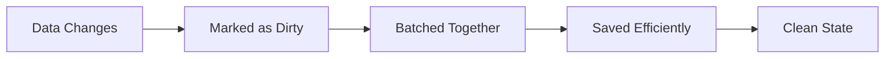

# Fulcrum Data API

## A Simple Explaination

Before we dive into code, let's understand the three main pieces:

### PlayerProfile
Think of [`PlayerProfile`](src/main/java/sh/harold/fulcrum/api/data/registry/PlayerProfile.java:1) as a player's data wallet. It holds all their information (stats, settings, achievements, etc.) and automatically tracks what's changed.

```java
PlayerProfile profile = PlayerProfileManager.getProfile(playerId);
PlayerStats stats = profile.get(PlayerStats.class);
stats.kills++;
profile.set(PlayerStats.class, stats); // Automatically tracked as "dirty"
```

### Data Schemas
These define what your data looks like and where it's stored. JSON for flexible data, SQL for structured data:

```java
// Flexible JSON data
public class PlayerSettings extends JsonSchema<PlayerSettings> {
    public Map<String, Object> settings = new HashMap<>();
}

// Structured SQL data  
@Table("player_stats")
public class PlayerStats {
    @Column(primary = true)
    public UUID playerId;
    
    @Column
    public int kills = 0;
}
```

### 3. Dirty Data Tracking
Instead of saving every change immediately, it tracks what's "dirty" (changed) and saves efficiently in batches.



## Quick Start:tm:
### 1. Define Your Data

```java
// PlayerStats.java - Your structured data
@Table("player_stats")
@SchemaVersion(1)
public class PlayerStats {
    @Column(primary = true, generation = PrimaryKeyGeneration.PLAYER_UUID)
    public UUID playerId;
    
    @Column
    public String displayName;
    
    @Column
    public int kills = 0;
    
    @Column
    public int deaths = 0;
    
    @Column
    public long lastLogin = System.currentTimeMillis();
}
```

### 2. Set Up the System

```java
// In your plugin's onEnable()
public void onEnable() {

    // 1. Register your data schema
    PlayerDataRegistry.registerSchema(
        new AutoTableSchema<>(PlayerStats.class), 
        sqlBackend
    );
    
    getLogger().info("Data API initialized!");
}
```

### 3. Use it in your plugin!

```java
// When a player joins
@EventHandler
public void onPlayerJoin(PlayerJoinEvent event) {
    UUID playerId = event.getPlayer().getUniqueId();
    
    // Get their profile (loads automatically)
    PlayerProfile profile = PlayerProfileManager.getProfile(playerId);
    
    // Get their stats
    PlayerStats stats = profile.get(PlayerStats.class);
    if (stats == null) {
        stats = new PlayerStats();
        stats.playerId = playerId;
        stats.displayName = event.getPlayer().getName();
    }
    
    // Update last login
    stats.lastLogin = System.currentTimeMillis(); // You don't actually need to do this in Fulcrum, as it's handled by the Identity fundamental.
    
    // Save (uses dirty tracking - won't hit database immediately)
    profile.set(PlayerStats.class, stats);
    
    event.getPlayer().sendMessage("Welcome back! You have " + stats.kills + " kills!");
}
```


## Boring stuff (API Reference):

### Core Classes

#### [`PlayerProfile`](src/main/java/sh/harold/fulcrum/api/data/registry/PlayerProfile.java:1)
> *Your main interface for player data*

```java
// Data access
<T> T get(Class<T> schemaType)                    // Get data, load if needed
<T> CompletableFuture<T> getAsync(Class<T> type)  // Async version
<T> void set(Class<T> schemaType, T value)        // Set data, mark as dirty

// Lifecycle management
void loadAll()                                    // Load all schemas
CompletableFuture<Void> loadAllAsync()            // Async load all
boolean isLoaded()                                // Check if loaded

// Persistence
void save(Class<T> type, T value)                 // Save with dirty tracking
void save(Class<T> type, T value, boolean immediate)  // Control immediate save
CompletableFuture<Void> saveAsync(Class<T> type, T value)  // Async save

// Dirty data management
boolean hasDirtyData()                            // Check for unsaved changes
int getDirtyDataCount()                           // Count dirty entries
CompletableFuture<Integer> flushDirtyData()       // Save all dirty data
void setDirtyTrackingEnabled(boolean enabled)    // Control dirty tracking
```

#### [`PlayerProfileManager`](src/main/java/sh/harold/fulcrum/api/data/registry/PlayerProfileManager.java:1)
> *Manages profile lifecycle*

```java
// Profile management
PlayerProfile getProfile(UUID playerId)          // Get or create profile
CompletableFuture<PlayerProfile> loadProfileAsync(UUID playerId)  // Async load
void unloadProfile(UUID playerId)                // Remove from cache

// Batch operations
Collection<PlayerProfile> getAllProfiles()       // Get all cached profiles
CompletableFuture<Void> saveAllAsync()          // Save all profiles
void shutdown()                                   // Cleanup resources
```

#### [`DirtyDataManager`](src/main/java/sh/harold/fulcrum/api/data/dirty/DirtyDataManager.java:1)
> *Handles change tracking and persistence*

```java
// Initialization
void initialize(DirtyDataCache cache)            // Initialize with cache
void shutdown()                                   // Cleanup resources
boolean isInitialized()                          // Check initialization

// Operations
void markDirty(UUID playerId, String schemaKey, Object data, ChangeType type)
int persistDirtyData(UUID playerId)              // Save player's dirty data
int persistAllDirtyData()                        // Save all dirty data
CompletableFuture<Integer> persistAllDirtyDataAsync()  // Async save all

// Configuration
void setAutoPersistInterval(Duration interval)   // Set save frequency
void setBatchSize(int size)                      // Set batch size
void setEntryMaxAge(Duration maxAge)             // Set cleanup threshold

// Monitoring
DirtyDataStats getStats()                        // Get current statistics
DirtyDataCache getCache()                        // Get cache instance
```

## Additional Information:
### Async Operations for Performance

It's always a good idea to handle data operations asynchronously to avoid blocking the main server thread. Here's how you can do that:

```java
public class AsyncPlayerManager {
    
    public CompletableFuture<PlayerStats> getStatsAsync(UUID playerId) {
        return CompletableFuture.supplyAsync(() -> {
            PlayerProfile profile = PlayerProfileManager.getProfile(playerId);
            return profile.get(PlayerStats.class);
        });
    }
    
    public CompletableFuture<Void> updateStatsAsync(UUID playerId, int kills, int deaths) {
        return CompletableFuture.runAsync(() -> {
            PlayerProfile profile = PlayerProfileManager.getProfile(playerId);
            PlayerStats stats = profile.get(PlayerStats.class);
            
            stats.kills = kills;
            stats.deaths = deaths;
            profile.set(PlayerStats.class, stats);
        });
    }
    
    public CompletableFuture<String> getLeaderboardAsync(int limit) {
        return CompletableFuture.supplyAsync(() -> {
            // This would typically query the database directly for performance
            // but we'll simulate with profile data
            return "Top Players:\n1. Player1 (100 kills)\n2. Player2 (95 kills)";
        });
    }
}
```

### Database Relationships with Foreign Keys

```java
@Table("guilds")
public class Guild {
    @Column(primary = true, generation = PrimaryKeyGeneration.RANDOM_UUID)
    public UUID id;
    
    @Column
    public String name;
    
    @Column
    public UUID ownerId;
    
    @Column
    public long createdAt;
}

@Table("guild_members")
public class GuildMember {
    @Column(primary = true, generation = PrimaryKeyGeneration.RANDOM_UUID)
    public UUID id;
    
    @Column
    public UUID playerId;
    
    @ForeignKey(references = Guild.class, onDelete = "CASCADE")
    public UUID guildId;
    
    @Column
    public String role;
    
    @Column
    public long joinedAt;
}

public class GuildManager {
    public void createGuild(UUID ownerId, String guildName) {
        // Create guild
        Guild guild = new Guild();
        guild.id = UUID.randomUUID();
        guild.name = guildName;
        guild.ownerId = ownerId;
        guild.createdAt = System.currentTimeMillis();
        
        // Save guild
        PlayerStorageManager.save(guild.id, new AutoTableSchema<>(Guild.class), guild);
        
        // Add owner as member
        GuildMember member = new GuildMember();
        member.id = UUID.randomUUID();
        member.playerId = ownerId;
        member.guildId = guild.id;
        member.role = "OWNER";
        member.joinedAt = System.currentTimeMillis();
        
        // Save member (foreign key constraint ensures guild exists)
        PlayerStorageManager.save(member.id, new AutoTableSchema<>(GuildMember.class), member);
    }
}
```
### Player Join/Quit Handling
```java
@EventHandler
public void onPlayerJoin(PlayerJoinEvent event) {
    UUID playerId = event.getPlayer().getUniqueId();
    
    PlayerProfileManager.loadProfileAsync(playerId)
        .thenAccept(profile -> {
            // Update last login, apply settings, etc.
            PlayerStats stats = profile.get(PlayerStats.class);
            stats.lastLogin = System.currentTimeMillis();
            profile.set(PlayerStats.class, stats);
        });
}

@EventHandler
public void onPlayerQuit(PlayerQuitEvent event) {
    UUID playerId = event.getPlayer().getUniqueId();
    
    PlayerProfile profile = PlayerProfileManager.getProfile(playerId);
    if (profile != null) {
        // Save immediately on quit
        profile.saveAllAsync(true).thenRun(() -> {
            PlayerProfileManager.unloadProfile(playerId);
        });
    }
}
```

### Batch Operations
```java
// Process multiple players efficiently
public void processBatch(Collection<UUID> playerIds) {
    CompletableFuture.allOf(
        playerIds.stream()
            .map(this::processPlayerAsync)
            .toArray(CompletableFuture[]::new)
    ).thenRun(() -> {
        // All players processed, batch save
        DirtyDataManager.persistAllDirtyDataAsync();
    });
}
```

## That's it!